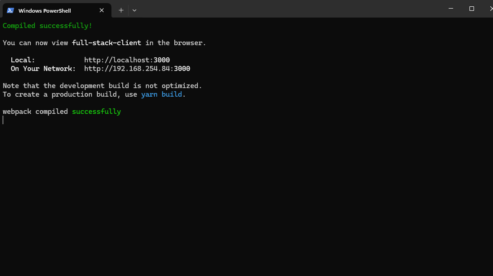

# Full Stack Web Application Portfolio Project

This project is a showcase of a full-stack web application I developed to demonstrate skills in web development, user authentication, and design. The app features a UI and a backend, making it an example of how to create applications.

## Features

### Backend
- **User Authentication**: Includes registration and login with password hashing.
- **CRUD Operations**: Implements Create, Read, Update, and Delete operations for user data.

### Frontend
- **Modern UI**: An interface built with React and TailwindCSS.
- **Responsive Design**: Mobile-friendly design for optimal user experience across devices.
- **Dynamic Interaction**: Feedback interactions.

## Skills Highlighted

### Programming and Frameworks
- Python (Flask)
- JavaScript (React)
- CSS (TailwindCSS)

### Development Tools
- Database Management with SQLAlchemy
- State Management and Axios for API Calls

### Deployment and Hosting
- Backend hosted on Render
- Frontend deployed on Vercel

### Security
- Password encryption with Flask-Bcrypt
- Cross-Origin Resource Sharing (CORS) handling

## Installation

### Prerequisites
- Python 3.x
- Node.js and npm/yarn
- Git

### Setup Instructions

#### Backend
1. Clone the repository:
   ```bash
   git clone https://github.com/1997-wh/SampleFullStack.git
   cd full-stack-app/backend
   ```
2. Create and activate a virtual environment:
   ```bash
   python -m venv venv
   source venv/bin/activate  # For Windows: venv\Scripts\activate
   ```
3. Install dependencies:
   ```bash
   pip install -r requirements.txt
   ```
4. Run the Flask application:
   ```bash
   python app.py
   ```

#### Frontend
1. Navigate to the frontend directory:
   ```bash
   cd ../frontend
   ```
2. Install dependencies:
   ```bash
   yarn install
   ```
3. Start the React application:
   ```bash
   yarn start
   ```

## Deployment



### Backend
- Hosted on Render.
- Configured with environment variables for database and application settings.

### Frontend
- Deployed on Vercel.

## About This Project

This project is part of my portfolio and showcases my ability to build a full-stack web application from scratch. It highlights my skills in:
- Creating interfaces.
- Developing backend systems.
- Deploying and managing web applications.

Feel free to do whatever you like to this

---

